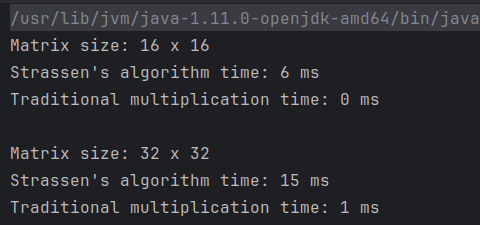
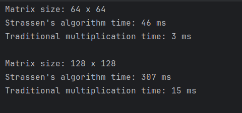
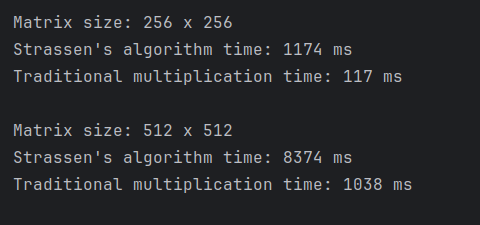
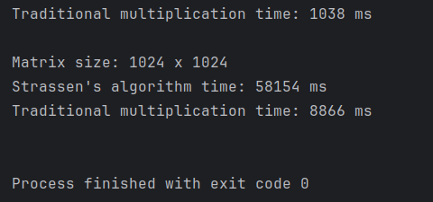

# Data Structures and Algorithms Assignment 5
My Strassen's algorithm does not become faster than my traditional matrix multiplication at any point that I tested. 

Here is the output from testing the speeds of my traditional matrix multiplication method against my Strassen's matrix multiplication method:

